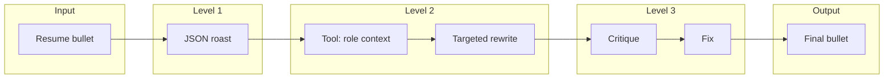
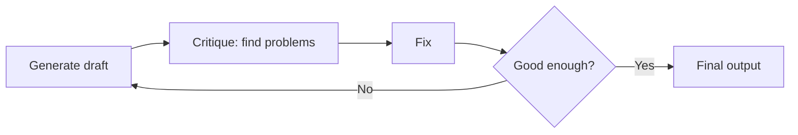
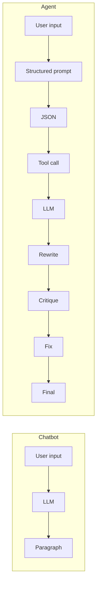

# Visual guide: Agentic AI concepts

These diagrams help you see how **structured output**, **tool use**, and **self-correction** fit together. They match the slides; use this page as a reference while coding.

---

## 1. How an agent works (full pipeline)

Our workshop pipeline: one input flows through three “superpowers” and becomes a production-ready output.

**Takeaway:** Structured output (Level 1) → Tool use (Level 2) → Self-correction (Level 3) = agentic flow.

---

## 2. The reflection pattern

Level 3 (and systems like Devin, AutoGPT) use this loop: generate, critique, fix, then decide if it’s good enough.

**Takeaway:** One reflection round = one pass (generate → critique → fix). Multiple rounds = keep looping until satisfied.

---

## 3. Chatbot vs agent (what changes)

| | Chatbot | Agent |
|---|--------|--------|
| **Output** | Paragraph, prose | **Structured data** (JSON) |
| **Context** | Only the prompt | **Tools** (APIs, docs, DB) |
| **Quality** | First draft only | **Self-critique** then fix |

---

## 4. Where you see this in the wild

- **Support bots:** Tool = look up order; self-correction = rephrase until the user is satisfied.
- **Code agents (Devin, Cursor):** Tools = read repo, run terminal; reflection = plan → run → review → fix.
- **Our workshop:** Tool = `get_role_requirements(role)`; reflection = Level 3 (find 3 problems → fix → final version).

Same three ideas everywhere: **structured output**, **tools**, **self-correction**.

---

Back to [README](README.md) · [Challenges](challenges/README.md)
